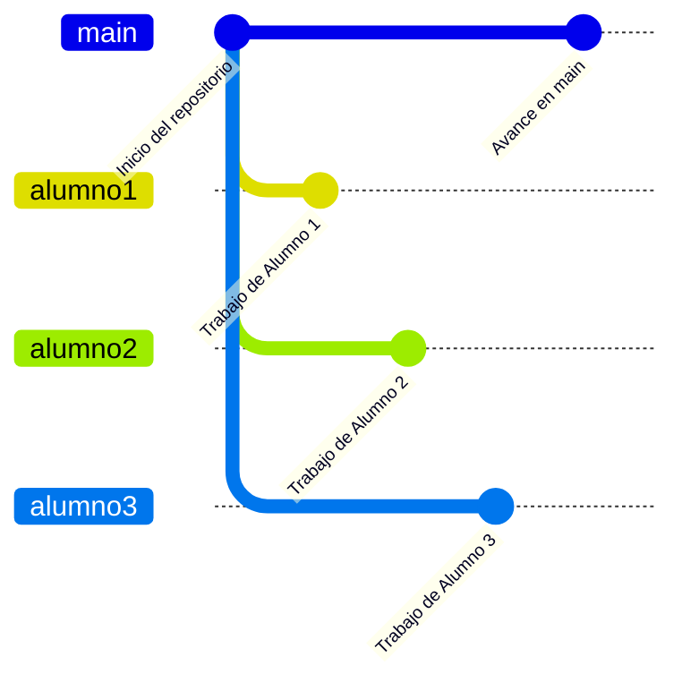

# ENUNCIADO

Este proyecto colaborativo tiene como objetivo desarrollar una aplicación de software utilizando GitHub como plataforma principal de gestión y control de versiones. El propósito es fomentar el trabajo en equipo, la integración de buenas prácticas de desarrollo y el aprendizaje del flujo de trabajo colaborativo en entornos reales.

## Objetivos
- Aprender y aplicar el uso de Git y GitHub en proyectos colaborativos.
- Desarrollar una solución funcional que resuelva una necesidad concreta.
- Practicar la gestión de incidencias, ramas, revisiones de código y solicitudes de extracción (pull requests).

## Requisitos
- Utilizar GitHub para la organización y seguimiento del proyecto.
- Documentar el proceso de desarrollo y las decisiones tomadas.
- Implementar las funcionalidades principales acordadas por el equipo.

## Alcance
El proyecto debe abordar un problema real o simulado, definiendo claramente las funcionalidades a implementar, los roles de los participantes y los entregables esperados. La solución final debe estar correctamente documentada y publicada en un repositorio de GitHub accesible para todos los miembros del equipo.
