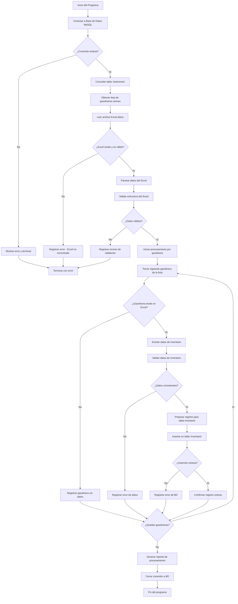

# GASOLINERAS

Principales cambios realizados:
1. Estructura modular:

crear_esquema(): Prepara la base de datos
obtener_estaciones(): Lee todas las estaciones de la tabla
cargar_inventario_estacion(): Procesa una estación específica
procesar_todas_las_estaciones(): Coordina todo el proceso

2. Procesamiento dinámico:

Lee automáticamente todas las estaciones de la tabla estacion
Para cada estación busca un archivo {estacion_id}.xlsx
Procesa cada archivo encontrado con la misma lógica original

3. Mejoras añadidas:

Manejo de errores robusto: Continúa procesando aunque falle una estación
Logging detallado: Muestra progreso y resultados de cada estación
Resumen final: Statistics de estaciones procesadas vs fallidas
Validación de archivos: Verifica que existe cada Excel antes de procesarlo

4. Configuración flexible:

Variable RUTA_BASE_EXCEL para cambiar la carpeta base
Función opcional agregar_estaciones_ejemplo() para testing

5. Estructura de archivos esperada:
C:\Users\sistemas\Desktop\gasolinas\
├── 1.xlsx  (para estación con ID 1)
├── 2.xlsx  (para estación con ID 2)
├── 3.xlsx  (para estación con ID 3)
└── ...

    style A fill:#90EE90
    style DD fill:#FFB6C1
    style EE fill:#FFA07A
    style B fill:#87CEEB
    style G fill:#DDA0DD
    style W fill:#F0E68C
 
